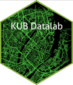

# KUB Datalab 0.0.1 

Palettes, themes and functions we tend to use a lot.

Palettes currently defined by UCPH-colors.

They will be adjusted, as UCPH-colors appears not to have been designed
with datavisualization in mind.
